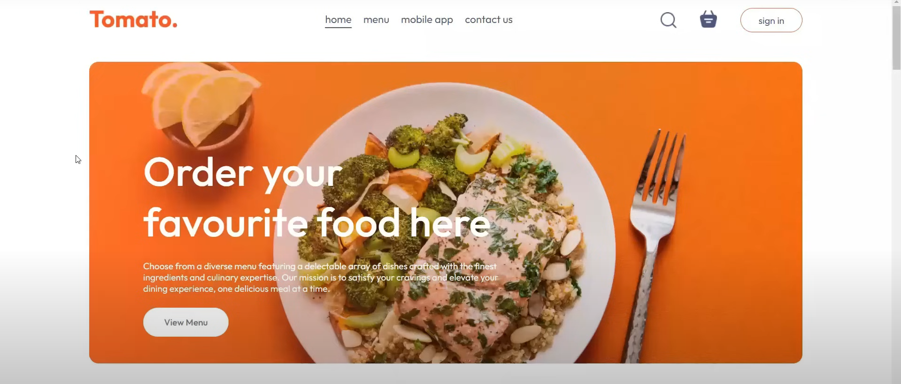

# 🍔 Flick — Full‑Stack Food Ordering App



A full-stack food ordering platform built with the MERN stack (MongoDB, Express, React, Node) and SCSS, featuring both customer-facing UI and an admin panel for managing orders, menus and users.

---

## 🚀 Tech Stack

- **Backend:** Node.js, Express.js  
- **Frontend:** React.js, SCSS  
- **Database:** MongoDB (via Mongoose)  
- **Auth & Security:** JSON Web Tokens (JWT), bcrypt  
- **Dev Tools:** Nodemon, Axios, dotenv

---

## 📁 Repository Structure

```text
Flick/
├── backend/               # Server-side code
│   ├── controllers/       # Route handlers
│   ├── models/            # Mongoose schemas
│   ├── routes/            # API routes
│   ├── middleware/        # Auth & error handling
│   ├── config/            # DB & env config
│   └── server.js          # App entry point
├── frontend/              # Client-side code
│   ├── public/            # Static assets
│   └── src/
│       ├── components/    # React UI components
│       ├── pages/         # Views (Admin, Home, Cart)
│       └── services/      # API interaction logic
├── package.json           # Monorepo scripts & dependencies
└── README.md              # Project documentation
```

## 🛠 Getting Started

To run this project locally:

```bash
# Clone the repo
git clone https://github.com/r4inr3aper/Flick.git
cd Flick

# Launch backend
cd backend
npm install
npm run dev

# Launch frontend
cd ../frontend
npm install
npm start
```

Backend runs on http://localhost:5000

Frontend runs on http://localhost:3000

---

## 📦 Features

-- **User Flow:** View menu, add items to cart, place orders
--**Admin Panel:** Manage menu, view/delete orders, monitor users
--**Auth:** Secure login/signup for admins and customers
--**API:** RESTful endpoints with proper validation & error handling

---

## 📄 API Endpoints

### 🔐 Auth

- `POST /auth/register` — Register a new user  
- `POST /auth/login` — Login and receive a JWT token  

### 📦 Orders

- `GET /orders` — (Admin) Retrieve a list of all orders  
- `POST /orders` — (Customer) Place a new order  

### 🍽 Menu

- `GET /menu` — Get all available menu items  
- `POST /menu` — (Admin) Add a new menu item  
- `PUT /menu/:id` — (Admin) Update a specific menu item  
- `DELETE /menu/:id` — (Admin) Delete a specific menu item  

## 📝 License

This project is open source and available under the [MIT License](LICENSE).
